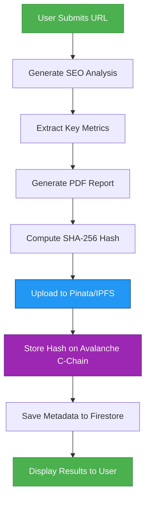
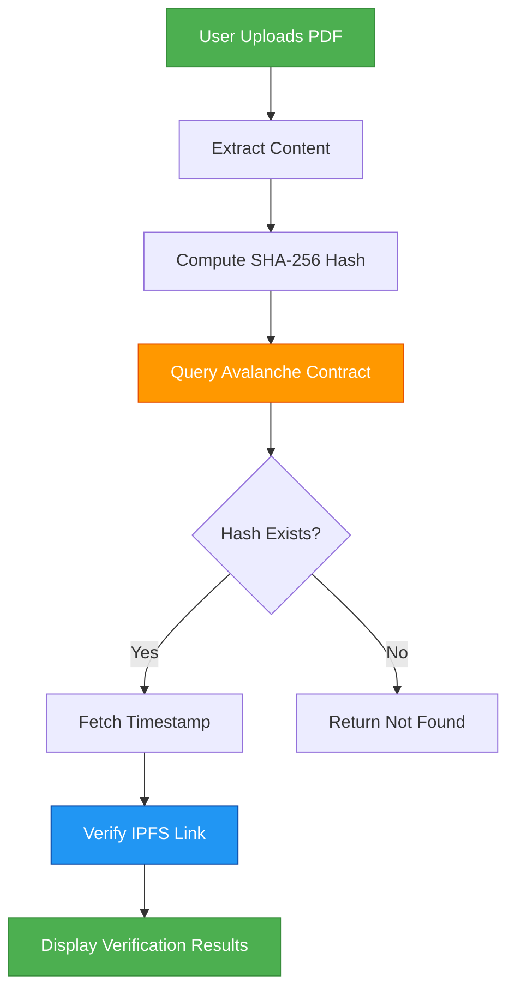
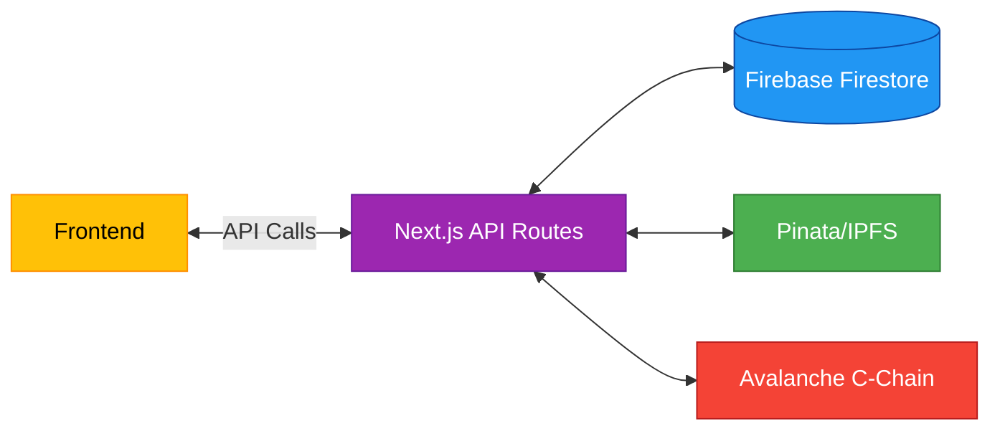

# 🌐 SEO Analysis & Blockchain Verification Platform

A decentralized application that generates SEO analysis reports, stores them on IPFS via Pinata, and verifies their authenticity on the Avalanche C-Chain. Built with Next.js 14 and Web3 technologies.

## 🚀 Key Features

- **SEO Analysis**: Generate comprehensive SEO reports for any website
- **Decentralized Storage**: Secure IPFS storage via Pinata with content addressing
- **Blockchain Verification**: Immutable proof of existence on Avalanche C-Chain
- **PDF Generation & Download**: Generate and download SEO reports as PDFs
- **Web3 Authentication**: Secure wallet connection via MetaMask
- **Report Management**: View, verify, and manage all your SEO reports

## 🛠️ Tech Stack

### Core Technologies

- **Frontend**: Next.js 14, React 18, TypeScript
- **Styling**: Tailwind CSS, Headless UI
- **State Management**: React Context, SWR

### Blockchain & Storage

- **Blockchain**: Avalanche C-Chain
- **Smart Contracts**: Solidity (0.8.0+)
- **Web3**: ethers.js 6.x
- **Decentralized Storage**: IPFS via Pinata
- **Authentication**: MetaMask, Web3Modal

### Backend & Utilities

- **API Routes**: Next.js API Routes
- **PDF Generation**: html2pdf.js
- **Form Handling**: React Hook Form
- **Data Validation**: Zod
- **HTTP Client**: Axios

## 🔄 System Workflows

### 1. Report Generation Flow



### 2. Verification Flow



### 3. Data Storage Architecture



## 📦 Project Structure

```
seo.ai/
├── src/
│   ├── app/                    # Next.js 13+ App Router
│   │   ├── api/                # API routes
│   │   │   ├── pinata/         # Pinata file operations
│   │   │   └── reports/        # Report management API
│   │   └── profile/            # User profile and reports
│   ├── components/             # Reusable UI components
│   ├── context/                # React context providers
│   └── lib/                    # Utility functions and configs
│       └── firebase.ts         # Firebase Firestore integration
└── scripts/                    # Deployment and utility scripts
    ├── deploy-contract.js      # Contract deployment script
    ├── check-contract.js       # Contract verification script
    └── verify.md               # Contract verification guide
```

## 🚀 Quick Start

### Prerequisites

- Node.js 18+ and npm
- MetaMask browser extension
- Pinata API keys
- Avalanche C-Chain RPC URL

### Installation

1. Clone the repository:

   ```bash
   git clone https://github.com/yourusername/seo.ai.git
   cd seo.ai
   ```

2. Install dependencies:

   ```bash
   npm install
   ```

3. Set up environment variables:

   ```env
   NEXT_PUBLIC_PINATA_API_KEY=your_pinata_api_key
   NEXT_PUBLIC_PINATA_SECRET_API_KEY=your_pinata_secret
   NEXT_PUBLIC_PINATA_JWT=your_pinata_jwt
   NEXT_PUBLIC_ALCHEMY_AVALANCHE_URL=your_alchemy_avalanche_url
   NEXT_PUBLIC_CONTRACT_ADDRESS=your_contract_address
   ```

4. Run the development server:
   ```bash
   npm run dev
   ```

## 🔧 Scripts

### Available Scripts

- `npm run dev` - Start development server
- `npm run build` - Create production build
- `npm start` - Start production server
- `npm run lint` - Run ESLint
- `npm run format` - Format code with Prettier

### Utility Scripts

#### 1. `deploy-contract.js`

Deploys the smart contract to Avalanche C-Chain.

**Usage:**

```bash
node scripts/deploy-contract.js --network avalanche
```

**Options:**

- `--network`: Target network (default: 'avalanche')
- `--private-key`: Private key for deployment (optional, uses .env if not provided)
- `--rpc`: Custom RPC URL (optional)

#### 2. `check-contract.js`

Verifies contract deployment and checks contract state.

**Usage:**

```bash
node scripts/check-contract.js --address 0xContractAddress
```

**Options:**

- `--address`: Contract address to check (required)
- `--network`: Network to check (default: 'avalanche')
- `--rpc`: Custom RPC URL (optional)

## 📝 Smart Contract

The `ReportVerification.sol` contract provides a simple and secure way to store and verify document hashes on the Avalanche C-Chain.

### Contract Features

- Store document hashes with timestamps
- Verify document existence and integrity
- Event emission for all state changes
- Simple and gas-efficient design

### Contract Code

```solidity
// SPDX-License-Identifier: MIT
pragma solidity ^0.8.0;

contract ReportVerification {
    // Maps report hashes to their storage timestamps
    mapping(string => uint256) private reportTimestamps;

    // Event emitted when a new report is stored
    event ReportStored(string indexed reportHash, uint256 timestamp);

    /**
     * @dev Store a report hash with the current block timestamp
     * @param _reportHash The hash of the report to store
     */
    function storeReport(string memory _reportHash) public {
        require(reportTimestamps[_reportHash] == 0, "Report already stored");
        reportTimestamps[_reportHash] = block.timestamp;
        emit ReportStored(_reportHash, block.timestamp);
    }

    /**
     * @dev Verify if a report hash exists and get its timestamp
     * @param _reportHash The hash of the report to verify
     * @return The timestamp when the report was stored, or 0 if not found
     */
    function verifyReport(string memory _reportHash) public view returns (uint256) {
        return reportTimestamps[_reportHash];
    }
}
```

### Key Functions

- `storeReport(string memory _reportHash)` - Store a new document hash
- `verifyReport(string memory _reportHash) → uint256` - Get the timestamp when a report was stored (returns 0 if not found)

## 🌐 API Endpoints

### 1. Pinata File Operations

- `POST /api/pinata/upload` - Upload file to IPFS via Pinata
- `GET /api/pinata/download?cid=<cid>` - Download file from IPFS

### 2. Report Management

- `GET /api/reports/[walletAddress]` - Get all reports for a wallet
- `POST /api/reports/store` - Store new report metadata

## 🔒 Security Considerations

- All sensitive operations require wallet authentication
- Private keys are never stored or transmitted
- Smart contract includes access control and ownership management
- Environment variables are used for sensitive configuration

## 📄 License

MIT

## 🚀 Getting Started

### Prerequisites

- Node.js 18+
- MetaMask browser extension
- Avalanche C-Chain testnet account (for development)
- Pinata API credentials

### Environment Variables

Create a `.env.local` file in the root directory:

```env
# Blockchain
AVALANCHE_RPC_URL=https://api.avax-test.network/ext/bc/C/rpc
AVALANCHE_CONTRACT_ADDRESS=0x...
AVALANCHE_PRIVATE_KEY=0x...  # For server-side transactions

# Pinata (choose one auth method)
PINATA_JWT=your_jwt_token
# OR
PINATA_API_KEY=your_api_key
PINATA_SECRET_API_KEY=your_secret_api_key

# Optional
PINATA_GATEWAY=your-subdomain.mypinata.cloud
NEXT_PUBLIC_WALLET_CONNECT_PROJECT_ID=your_walletconnect_id
```

### Installation

1. Clone the repository
2. Install dependencies:
   ```bash
   npm install
   # or
   yarn install
   ```
3. Run the development server:
   ```bash
   npm run dev
   # or
   yarn dev
   ```
4. Open [http://localhost:3000](http://localhost:3000) in your browser

## 📝 Usage

### 1. Generate SEO Report

1. Navigate to the home page
2. Enter a website URL and click "Generate Report"
3. The system will:
   - Analyze the website
   - Generate a PDF report
   - Upload to IPFS via Pinata
   - Store the hash on Avalanche C-Chain
4. View and download the report with verification details

### 2. Verify Report

1. Go to `/verify`
2. Upload a previously generated PDF
3. The system will:
   - Compute the file's SHA-256 hash
   - Query the Avalanche contract
   - Display verification status and timestamp

## 🔗 Why Web3 for PDF Verification?

### The Problem with Traditional Verification

Traditional document verification systems suffer from several limitations:

1. **Centralized Trust**: Reliance on a single authority that can be compromised
2. **Tamper Risk**: Documents can be altered without detection
3. **Verification Complexity**: Difficult to independently verify document authenticity
4. **Single Point of Failure**: Centralized servers can go down or be censored

### How Web3 Solves This

1. **Immutable Record**

   - Once a document's hash is stored on the blockchain, it cannot be altered or deleted
   - Provides cryptographic proof of the document's existence at a specific time

2. **Decentralized Verification**

   - No single entity controls the verification process
   - Anyone can independently verify a document without permission
   - Eliminates the need to trust a central authority

3. **Tamper-Evident**

   - The SHA-256 hash acts as a unique fingerprint for each document
   - Even a single character change creates a completely different hash
   - Any tampering is immediately detectable during verification

4. **Transparent Audit Trail**

   - Blockchain provides a public, timestamped record of when the document was registered
   - Full history of verifications is permanently stored and auditable

5. **No Single Point of Failure**
   - The verification system remains operational as long as the blockchain exists
   - No central server that can be taken down or censored

### Real-World Benefits

- **Legal Documents**: Prove the existence and integrity of contracts
- **Academic Credentials**: Verify the authenticity of certificates and degrees
- **Financial Records**: Ensure audit trails cannot be altered
- **Intellectual Property**: Timestamp and verify ownership of creative works
- **Supply Chain**: Track and verify the authenticity of documents at each step

## 🔒 Security Considerations

- **Private Key Management**: The server's private key is used only for storing hashes on-chain. Never expose it client-side.
- **File Hashing**: SHA-256 is used to create content-addressable hashes of reports.
- **Immutable Verification**: Once stored on-chain, report hashes cannot be altered or deleted.

## 🌐 Web3 Integration

The application uses a hybrid approach:

1. **Server-Side Transactions**:

   - The server handles the actual blockchain transactions using a dedicated wallet
   - This ensures consistent gas payments and better reliability

2. **Client-Side Verification**:

   - Users can verify reports without needing a wallet
   - The verification is done by querying the blockchain directly

3. **Wallet Connection**:
   - MetaMask integration for future features
   - Web3Modal for wallet connection UI

## 📚 API Endpoints

### `POST /api/pinata/upload`

Uploads a file to IPFS and stores its hash on-chain.

**Request:**

```http
POST /api/pinata/upload
Content-Type: multipart/form-data

file: <PDF file>
```

**Response:**

```json
{
  "success": true,
  "cid": "QmXx...",
  "ipfsUrl": "https://...",
  "hash": "0x...",
  "txHash": "0x...",
  "blockNumber": 12345678,
  "pinataUrl": "https://..."
}
```

### `POST /api/verifyReport`

Verifies if a file's hash exists on-chain.

**Request:**

```http
POST /api/verifyReport
Content-Type: multipart/form-data

file: <PDF file>
```

**Response (Success):**

```json
{
  "valid": true,
  "timestamp": 1634567890,
  "hash": "0x..."
}
```

**Response (Not Found):**

```json
{
  "valid": false,
  "message": "Report not found on chain"
}
```

## 📦 Deployment

### Vercel (Recommended)

1. Push your code to a GitHub/GitLab repository
2. Import the repository to Vercel
3. Add the environment variables in the Vercel dashboard
4. Deploy!

### Self-Hosted

1. Build the application:
   ```bash
   npm run build
   ```
2. Start the production server:
   ```bash
   npm start
   ```
3. Set up a reverse proxy (Nginx/Apache) if needed

## 📄 License

MIT

## 🙏 Acknowledgements

- [Next.js](https://nextjs.org/)
- [Avalanche](https://www.avax.network/)
- [Pinata](https://www.pinata.cloud/)
- [ethers.js](https://docs.ethers.io/)

## 🤝 Contributing

1. Fork the repository
2. Create your feature branch (`git checkout -b feature/AmazingFeature`)
3. Commit your changes (`git commit -m 'Add some AmazingFeature'`)
4. Push to the branch (`git push origin feature/AmazingFeature`)
5. Open a Pull Request

# 📚 Data Models and Schemas

This section documents the shapes we persist or exchange via APIs. Use this as the single source of truth for contracts between client, server, and chain.

## Firestore Collections

- `users/{walletAddress}`

  - `walletAddress: string` — EVM address (checksum optional)
  - `createdAt: number` — epoch seconds
  - `updatedAt: number` — epoch seconds

- `reports/{autoId}`
  - `walletAddress: string`
  - `hash: string` — SHA-256 hex string of the PDF/report content
  - `ipfsCid: string` — IPFS CID returned by Pinata
  - `ipfsUrl: string` — gateway URL (optional)
  - `title: string` — report title
  - `score: number` — overall SEO score
  - `createdAt: number` — epoch seconds
  - `onChainTxHash?: string` — transaction hash for store operation
  - `onChainTimestamp?: number` — timestamp returned by contract

## API DTOs (request/response)

- `POST /api/pinata/upload` multipart form-data

  - request: `file: Blob`
  - response success:
    ```json
    {
      "success": true,
      "cid": "Qm...",
      "ipfsUrl": "https://...",
      "hash": "<sha256-hex>",
      "txHash": "0x...",
      "blockNumber": 123,
      "pinataUrl": "https://..."
    }
    ```

- `POST /api/verifyReport` multipart form-data

  - request: `file: Blob`
  - response success:
    ```json
    { "valid": true, "timestamp": 1712345678, "hash": "<sha256-hex>" }
    ```
  - response not-found:
    ```json
    { "valid": false, "message": "Report not found on chain" }
    ```

- `GET /api/reports/[walletAddress]`
  - response:
    ```json
    {
      "success": true,
      "reports": [
        /* Report documents as above */
      ]
    }
    ```

# ⚙️ Configuration Reference

- `AVALANCHE_RPC_URL` — HTTPS RPC endpoint to Avalanche C-Chain (testnet or mainnet)
- `AVALANCHE_CONTRACT_ADDRESS` — Deployed `ReportVerification` contract address
- `AVALANCHE_PRIVATE_KEY` — Server-side signer for write ops (secure, never exposed client-side)
- `PINATA_JWT` or `PINATA_API_KEY` + `PINATA_SECRET_API_KEY` — Pinata authentication
- `PINATA_GATEWAY` — Optional dedicated gateway subdomain
- `NEXT_PUBLIC_*` — Variables safe for the browser. Keep sensitive keys server-side only.

Local setup checklist:

- Create `.env.local` with required variables
- Ensure MetaMask is installed for local wallet connection
- Verify `scripts/deploy-contract.js` network config matches your RPC
- If using testnet, pre-fund the deployer address with test AVAX

# 🧱 Detailed Architecture

- `src/app/` — App Router pages and API routes
  - `api/pinata/*` — IPFS upload/download via Pinata
  - `api/verifyReport` — Verifies uploaded PDF hash against on-chain record
  - `api/reports/*` — Fetch reports for a given wallet
- `src/context/web3Context.tsx` — Wallet connection and basic state
- `src/lib/firebase.ts` — Firestore/Storage interoperability
- `src/lib/web3.ts` — Crypto utilities (e.g., `generateReportHash`)
- `ReportVerification.sol` — Smart contract storing report hashes → timestamps

Interactions:

1. Client generates SEO metrics → builds PDF → computes SHA-256
2. Server uploads file to IPFS (Pinata) and stores hash on-chain via contract
3. Server persists metadata in Firestore for fast listing
4. Verification re-computes SHA-256 and cross-checks the contract mapping

# 🧭 End-to-End Walkthrough

1. Generate report on `/generate`
2. Confirm PDF preview → click Save/Upload
3. Server handles upload and on-chain store, then returns CID + tx hash
4. Report appears in user dashboard/profile with chain timestamp
5. Verify any time by uploading the same PDF on `/verify`

Manual verification via curl:

```bash
curl -X POST http://localhost:3000/api/verifyReport \
  -F file=@./my-report.pdf
```

Query reports for a wallet:

```bash
curl http://localhost:3000/api/reports/0xYourWalletAddress
```

# 🔗 Smart Contract Interaction Guide

ABI excerpt (for reference):

```json
[
  {
    "type": "function",
    "name": "storeReport",
    "inputs": [{ "name": "_reportHash", "type": "string" }],
    "stateMutability": "nonpayable"
  },
  {
    "type": "function",
    "name": "verifyReport",
    "inputs": [{ "name": "_reportHash", "type": "string" }],
    "outputs": [{ "type": "uint256" }],
    "stateMutability": "view"
  },
  {
    "type": "event",
    "name": "ReportStored",
    "inputs": [
      { "name": "reportHash", "type": "string", "indexed": true },
      { "name": "timestamp", "type": "uint256", "indexed": false }
    ]
  }
]
```

Quick script (ethers v6) to read a hash:

```ts
import { JsonRpcProvider, Contract } from "ethers";

const provider = new JsonRpcProvider(process.env.AVALANCHE_RPC_URL!);
const abi = ["function verifyReport(string) view returns (uint256)"];
const contract = new Contract(
  process.env.AVALANCHE_CONTRACT_ADDRESS!,
  abi,
  provider
);

const ts = await contract.verifyReport("<sha256-hex>");
console.log(Number(ts));
```

# 🧪 Testing

- Unit test hashing utilities in `src/lib/web3.ts`
- Use a small set of fixture PDFs to validate end-to-end flow in dev
- Contract tests: run `scripts/check-contract.js` against a local or testnet RPC

# 🛠️ Troubleshooting

- **Deployment fails with missing env**: ensure `.env.local` provides `AVALANCHE_RPC_URL`, `AVALANCHE_CONTRACT_ADDRESS`, and Pinata credentials.
- **window.ethereum type errors during build**: see `src/context/web3Context.tsx` for EIP-1193 provider typing.
- **Report not found on chain**: Verify the computed SHA-256 matches the stored one. Even minor PDF changes alter the hash.
- **Pinata upload errors**: Check JWT/API keys and ensure file sizes are within Pinata limits.
- **CORS or gateway access**: Prefer your dedicated `PINATA_GATEWAY` subdomain.

# ❓ FAQ

- **What exactly is stored on-chain?**
  Only the SHA-256 hash (a fixed-length fingerprint). No raw content or PII is written to the blockchain.

- **Can I verify without a wallet?**
  Yes. Verification is a read-only chain query handled by the server.

- **Do I need AVAX to verify?**
  No. Only write operations consume gas. Reads are free via the RPC provider.

- **What happens if my PDF changes slightly?**
  The hash changes completely, so verification will fail. Re-generate and store again to create a new on-chain record.

# 📖 Glossary

- **IPFS** — InterPlanetary File System, content-addressed storage
- **CID** — Content Identifier (hash of content + multicodec info)
- **EIP-1193** — Ethereum provider standard (e.g., `window.ethereum`)
- **C-Chain** — Avalanche EVM-compatible chain

# 🗺️ Roadmap

- Role-based access for organizational reports
- Encrypted, client-side generated PDFs
- Batch verification and bulk exports
- Walletless login via email magic links
- On-chain merkle batching to reduce gas

# 🧹 Maintenance

- Keep dependencies updated; see `package.json`
- Re-run `npm run lint` before commits
- Prefer server-side secrets; never expose private keys to the client

## 📧 Contact

Senapati484 - [@sayan4.vercel.app](https://sayan4.vercel.app) - sayansenapati2544@gmail.com

Project Link: [https://github.com/senapati484/seo.ai](https://github.com/senapati484/seo.ai)

This project uses [`next/font`](https://nextjs.org/docs/app/building-your-application/optimizing/fonts) to automatically optimize and load [Geist](https://vercel.com/font), a new font family for Vercel.

## Learn More

To learn more about Next.js, take a look at the following resources:

- [Next.js Documentation](https://nextjs.org/docs) - learn about Next.js features and API.
- [Learn Next.js](https://nextjs.org/learn) - an interactive Next.js tutorial.

You can check out [the Next.js GitHub repository](https://github.com/vercel/next.js) - your feedback and contributions are welcome!

## Deploy on Vercel

The easiest way to deploy your Next.js app is to use the [Vercel Platform](https://vercel.com/new?utm_medium=default-template&filter=next.js&utm_source=create-next-app&utm_campaign=create-next-app-readme) from the creators of Next.js.

Check out our [Next.js deployment documentation](https://nextjs.org/docs/app/building-your-application/deploying) for more details.

## made with ❤️ by Sayan Senapati
