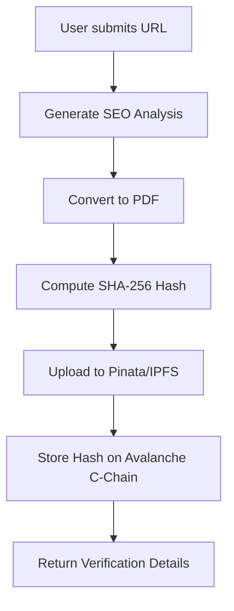
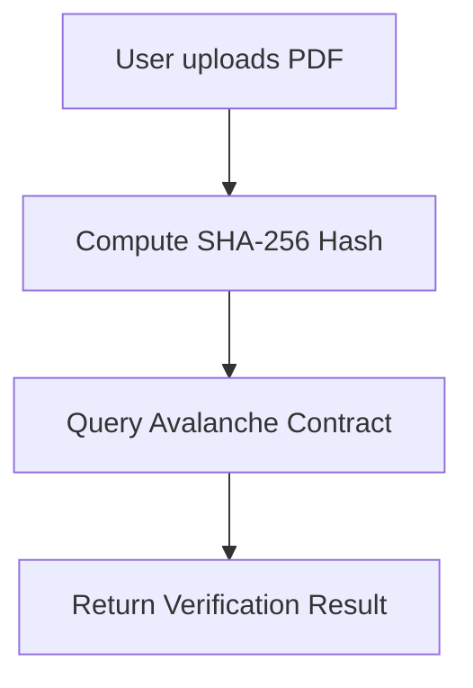

# SEO Analysis & Blockchain Verification Platform

A Next.js application that generates SEO analysis reports, stores them on IPFS via Pinata, and verifies their authenticity on the Avalanche C-Chain.

## 🌟 Features

- **SEO Analysis**: Generate detailed SEO reports for any website
- **IPFS Storage**: Securely store reports on IPFS via Pinata
- **Blockchain Verification**: Verify report authenticity on Avalanche C-Chain
- **PDF Generation**: Download reports as PDFs with verification details
- **Web3 Integration**: Connect with MetaMask for decentralized identity

## 🛠️ Tech Stack

- **Frontend**: Next.js 14, TypeScript, Tailwind CSS
- **Blockchain**: Avalanche C-Chain, ethers.js
- **Storage**: IPFS via Pinata
- **Web3**: MetaMask, ethers.js
- **PDF Generation**: html2pdf.js

## 🏗️ Architecture

### 1. Report Generation Flow



### 2. Verification Flow



## 🔗 Smart Contract

### Storage Contract (Solidity)

```solidity
// SPDX-License-Identifier: MIT
pragma solidity ^0.8.0;

contract ReportVerification {
    mapping(bytes32 => uint256) private reportTimestamps;

    event ReportStored(bytes32 indexed reportHash, uint256 timestamp);

    function storeReport(string memory _reportHash) public {
        bytes32 hash = keccak256(abi.encodePacked(_reportHash));
        require(reportTimestamps[hash] == 0, "Report already stored");
        reportTimestamps[hash] = block.timestamp;
        emit ReportStored(hash, block.timestamp);
    }

    function verifyReport(string memory _reportHash) public view returns (uint256) {
        bytes32 hash = keccak256(abi.encodePacked(_reportHash));
        return reportTimestamps[hash];
    }
}
```

## 🚀 Getting Started

### Prerequisites

- Node.js 18+
- MetaMask browser extension
- Avalanche C-Chain testnet account (for development)
- Pinata API credentials

### Environment Variables

Create a `.env.local` file in the root directory:

```env
# Blockchain
AVALANCHE_RPC_URL=https://api.avax-test.network/ext/bc/C/rpc
AVALANCHE_CONTRACT_ADDRESS=0x...
AVALANCHE_PRIVATE_KEY=0x...  # For server-side transactions

# Pinata (choose one auth method)
PINATA_JWT=your_jwt_token
# OR
PINATA_API_KEY=your_api_key
PINATA_SECRET_API_KEY=your_secret_api_key

# Optional
PINATA_GATEWAY=your-subdomain.mypinata.cloud
NEXT_PUBLIC_WALLET_CONNECT_PROJECT_ID=your_walletconnect_id
```

### Installation

1. Clone the repository
2. Install dependencies:
   ```bash
   npm install
   # or
   yarn install
   ```
3. Run the development server:
   ```bash
   npm run dev
   # or
   yarn dev
   ```
4. Open [http://localhost:3000](http://localhost:3000) in your browser

## 📝 Usage

### 1. Generate SEO Report

1. Navigate to the home page
2. Enter a website URL and click "Generate Report"
3. The system will:
   - Analyze the website
   - Generate a PDF report
   - Upload to IPFS via Pinata
   - Store the hash on Avalanche C-Chain
4. View and download the report with verification details

### 2. Verify Report

1. Go to `/verify`
2. Upload a previously generated PDF
3. The system will:
   - Compute the file's SHA-256 hash
   - Query the Avalanche contract
   - Display verification status and timestamp

## 🔗 Why Web3 for PDF Verification?

### The Problem with Traditional Verification

Traditional document verification systems suffer from several limitations:

1. **Centralized Trust**: Reliance on a single authority that can be compromised
2. **Tamper Risk**: Documents can be altered without detection
3. **Verification Complexity**: Difficult to independently verify document authenticity
4. **Single Point of Failure**: Centralized servers can go down or be censored

### How Web3 Solves This

1. **Immutable Record**

   - Once a document's hash is stored on the blockchain, it cannot be altered or deleted
   - Provides cryptographic proof of the document's existence at a specific time

2. **Decentralized Verification**

   - No single entity controls the verification process
   - Anyone can independently verify a document without permission
   - Eliminates the need to trust a central authority

3. **Tamper-Evident**

   - The SHA-256 hash acts as a unique fingerprint for each document
   - Even a single character change creates a completely different hash
   - Any tampering is immediately detectable during verification

4. **Transparent Audit Trail**

   - Blockchain provides a public, timestamped record of when the document was registered
   - Full history of verifications is permanently stored and auditable

5. **No Single Point of Failure**
   - The verification system remains operational as long as the blockchain exists
   - No central server that can be taken down or censored

### Real-World Benefits

- **Legal Documents**: Prove the existence and integrity of contracts
- **Academic Credentials**: Verify the authenticity of certificates and degrees
- **Financial Records**: Ensure audit trails cannot be altered
- **Intellectual Property**: Timestamp and verify ownership of creative works
- **Supply Chain**: Track and verify the authenticity of documents at each step

## 🔒 Security Considerations

- **Private Key Management**: The server's private key is used only for storing hashes on-chain. Never expose it client-side.
- **File Hashing**: SHA-256 is used to create content-addressable hashes of reports.
- **Immutable Verification**: Once stored on-chain, report hashes cannot be altered or deleted.

## 🌐 Web3 Integration

The application uses a hybrid approach:

1. **Server-Side Transactions**:

   - The server handles the actual blockchain transactions using a dedicated wallet
   - This ensures consistent gas payments and better reliability

2. **Client-Side Verification**:

   - Users can verify reports without needing a wallet
   - The verification is done by querying the blockchain directly

3. **Wallet Connection**:
   - MetaMask integration for future features
   - Web3Modal for wallet connection UI

## 📚 API Endpoints

### `POST /api/pinata/upload`

Uploads a file to IPFS and stores its hash on-chain.

**Request:**

```http
POST /api/pinata/upload
Content-Type: multipart/form-data

file: <PDF file>
```

**Response:**

```json
{
  "success": true,
  "cid": "QmXx...",
  "ipfsUrl": "https://...",
  "hash": "0x...",
  "txHash": "0x...",
  "blockNumber": 12345678,
  "pinataUrl": "https://..."
}
```

### `POST /api/verifyReport`

Verifies if a file's hash exists on-chain.

**Request:**

```http
POST /api/verifyReport
Content-Type: multipart/form-data

file: <PDF file>
```

**Response (Success):**

```json
{
  "valid": true,
  "timestamp": 1634567890,
  "hash": "0x..."
}
```

**Response (Not Found):**

```json
{
  "valid": false,
  "message": "Report not found on chain"
}
```

## 📦 Deployment

### Vercel (Recommended)

1. Push your code to a GitHub/GitLab repository
2. Import the repository to Vercel
3. Add the environment variables in the Vercel dashboard
4. Deploy!

### Self-Hosted

1. Build the application:
   ```bash
   npm run build
   ```
2. Start the production server:
   ```bash
   npm start
   ```
3. Set up a reverse proxy (Nginx/Apache) if needed

## 📄 License

MIT

## 🙏 Acknowledgements

- [Next.js](https://nextjs.org/)
- [Avalanche](https://www.avax.network/)
- [Pinata](https://www.pinata.cloud/)
- [ethers.js](https://docs.ethers.io/)

## 🤝 Contributing

1. Fork the repository
2. Create your feature branch (`git checkout -b feature/AmazingFeature`)
3. Commit your changes (`git commit -m 'Add some AmazingFeature'`)
4. Push to the branch (`git push origin feature/AmazingFeature`)
5. Open a Pull Request

## 📧 Contact

Your Name - [@yourtwitter](https://twitter.com/sayansenapati11) - sayansenapati2544@gmail.com

Project Link: [https://github.com/senapati484/seo.ai](https://github.com/senapati484/seo.ai)

This project uses [`next/font`](https://nextjs.org/docs/app/building-your-application/optimizing/fonts) to automatically optimize and load [Geist](https://vercel.com/font), a new font family for Vercel.

## Learn More

To learn more about Next.js, take a look at the following resources:

- [Next.js Documentation](https://nextjs.org/docs) - learn about Next.js features and API.
- [Learn Next.js](https://nextjs.org/learn) - an interactive Next.js tutorial.

You can check out [the Next.js GitHub repository](https://github.com/vercel/next.js) - your feedback and contributions are welcome!

## Deploy on Vercel

The easiest way to deploy your Next.js app is to use the [Vercel Platform](https://vercel.com/new?utm_medium=default-template&filter=next.js&utm_source=create-next-app&utm_campaign=create-next-app-readme) from the creators of Next.js.

Check out our [Next.js deployment documentation](https://nextjs.org/docs/app/building-your-application/deploying) for more details.

## made with ❤️ by Sayan Senapati
